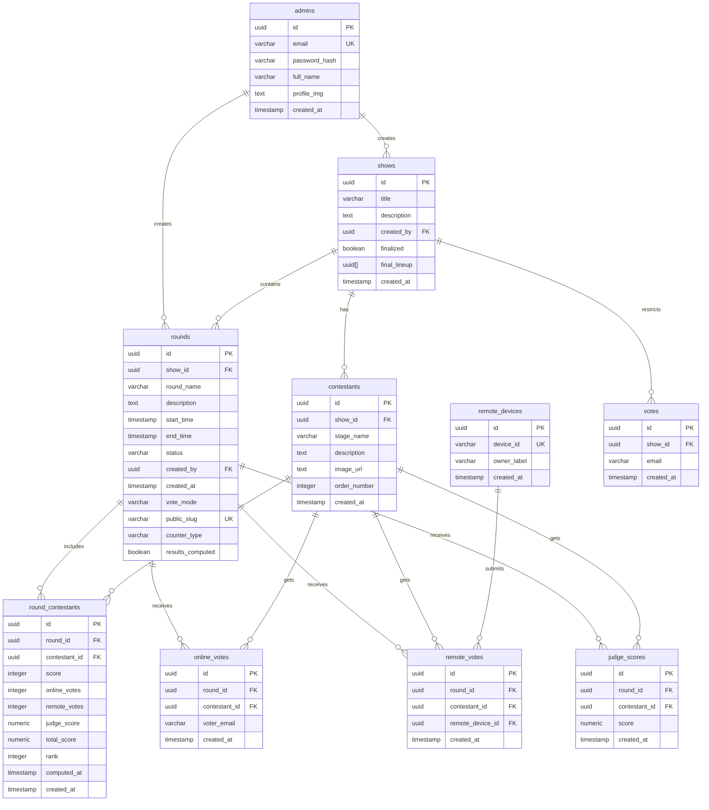
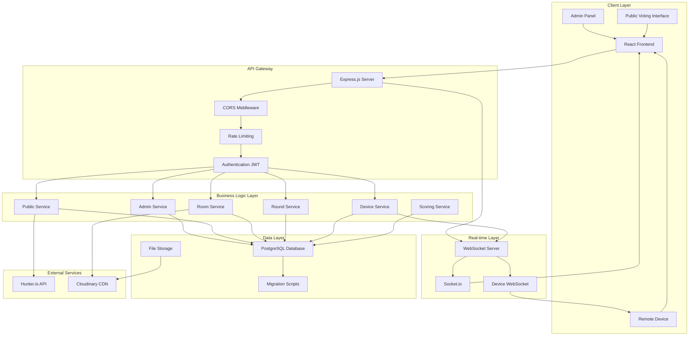
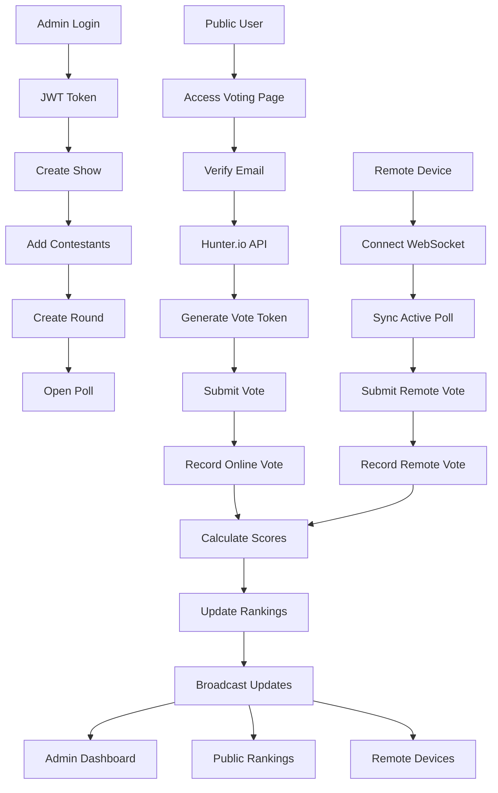
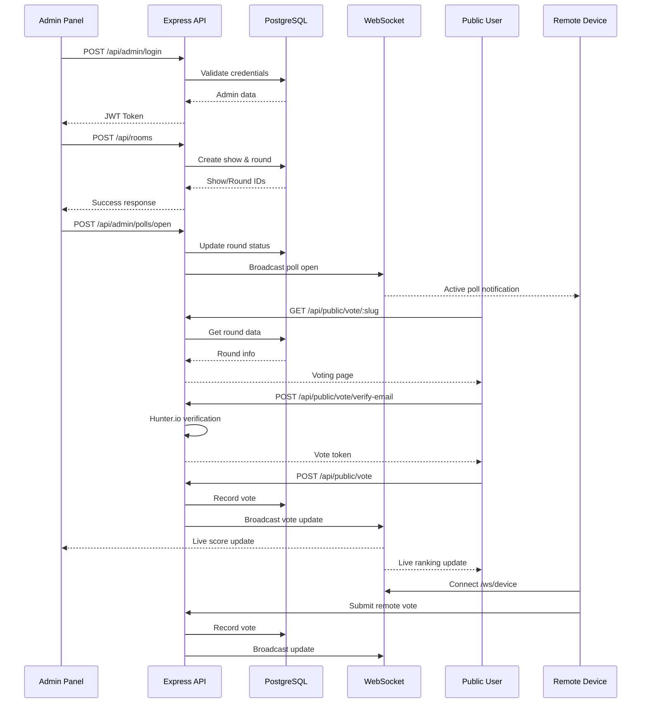
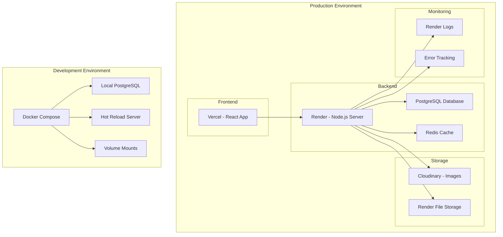
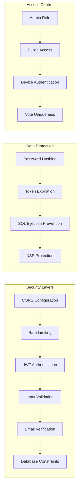
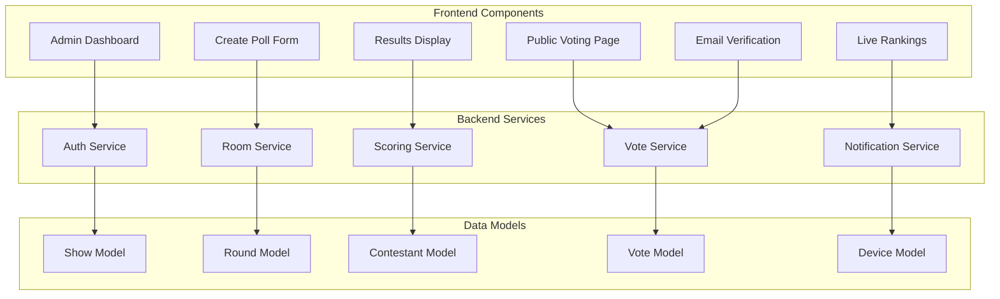
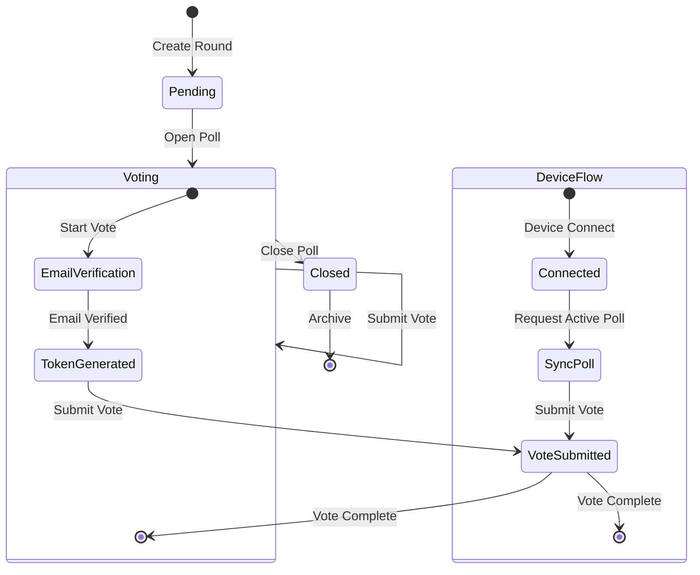

# VoteNext System Diagrams

---

## 1. ER Diagram (Entity-Relationship Diagram)

---

## 2. System Architecture Diagram

---

## 3. Data Flow Diagram

---

## 4. API Flow Diagram

---

## 5. Deployment Architecture Diagram

---

## 6. Security Architecture Diagram

---

## 7. Component Interaction Diagram

---

## 8. State Management Diagram

---

## Legend

### Symbols
- `PK`: Primary Key
- `FK`: Foreign Key
- `UK`: Unique Key
- `||--o{`: One-to-Many relationship
- `-->`: Data flow or dependency

### Colors (in rendered diagrams)
- **Blue**: Database entities
- **Green**: API services
- **Orange**: External services
- **Purple**: Real-time components
- **Red**: Security components

### Notes
- All UUID fields use `uuid_generate_v4()` as default
- Timestamps use `TIMESTAMPTZ DEFAULT now()`
- All foreign keys have `ON DELETE CASCADE` where specified
- WebSocket connections use Socket.io for real-time updates
