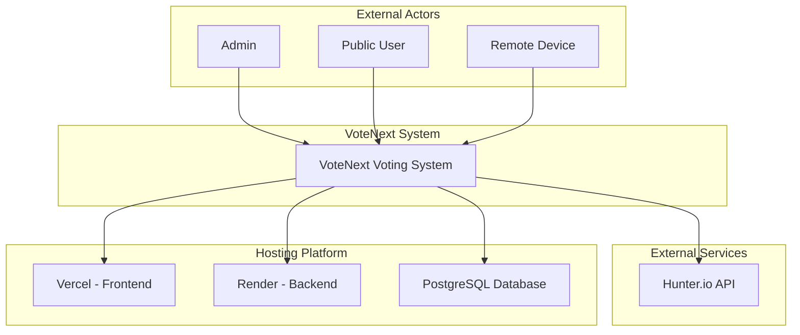
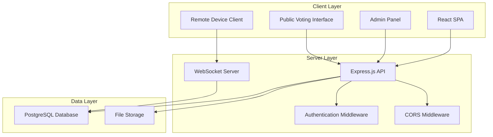
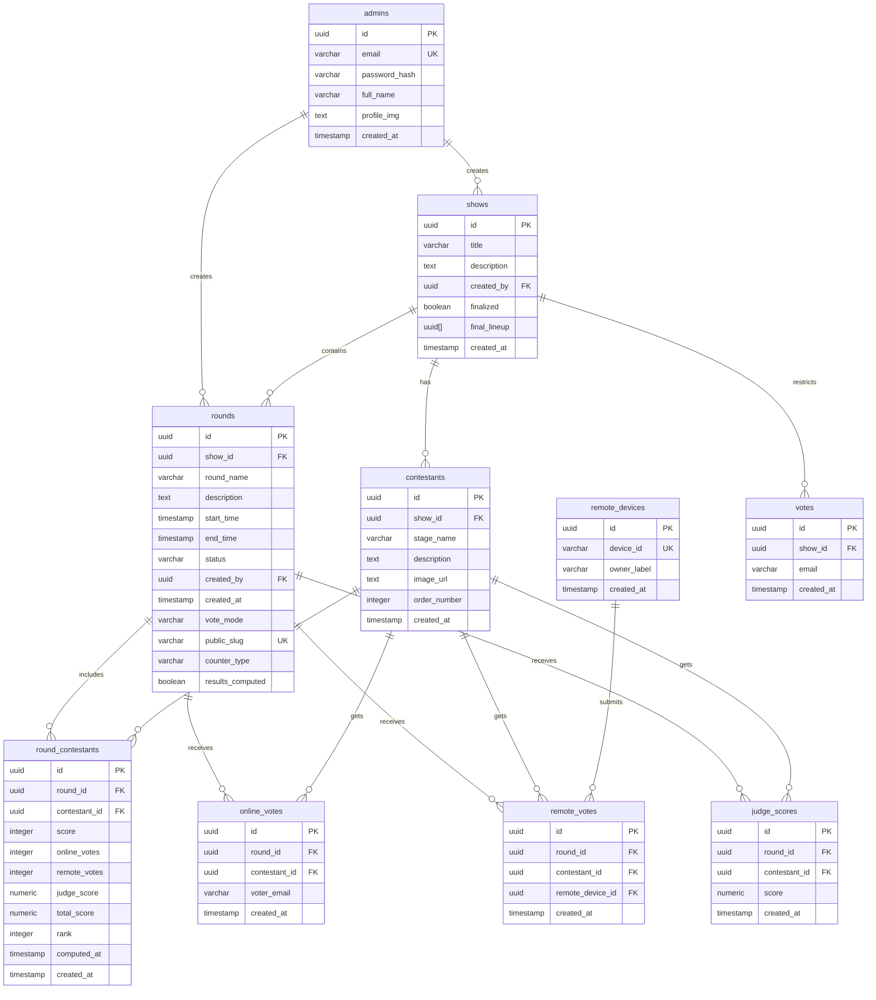
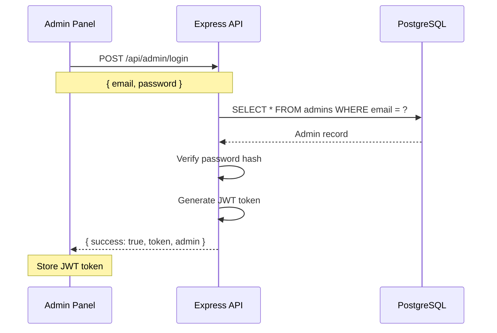
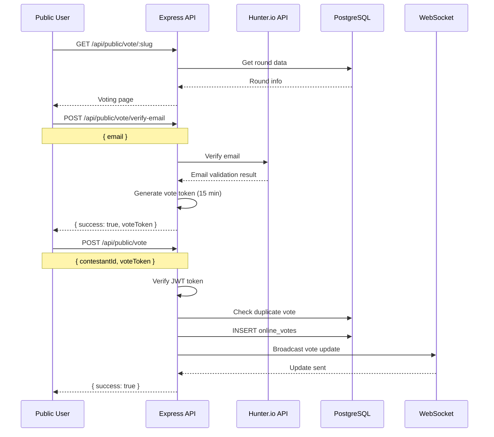
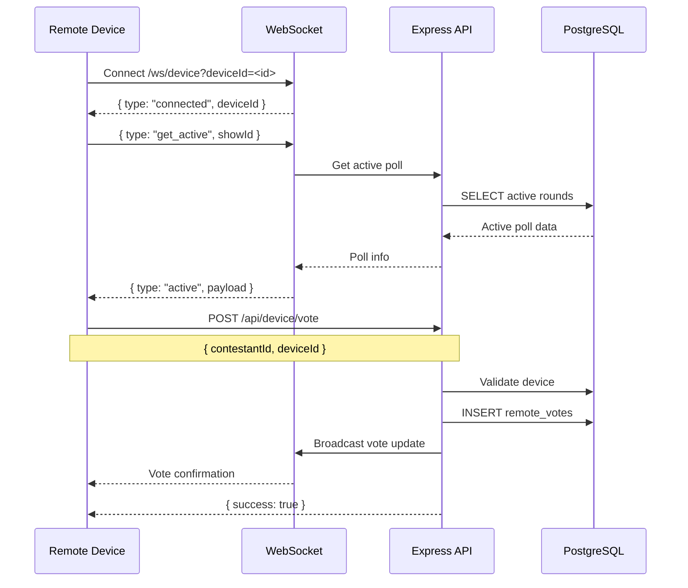
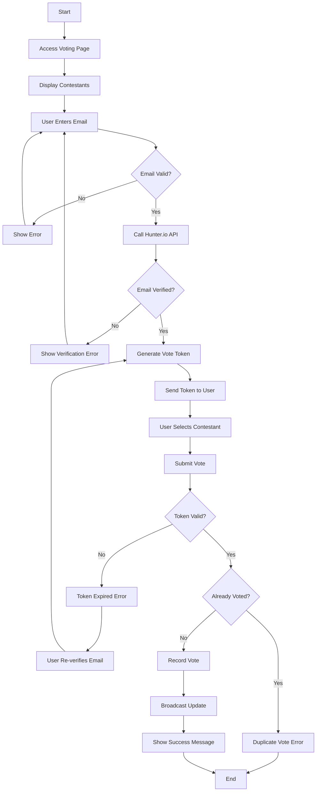
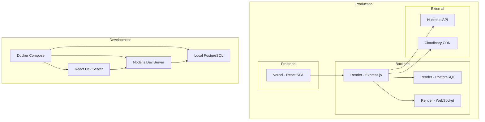

# VoteNext System Diagrams (Mermaid Only)

## 1) System Context Diagram

## 2) High-Level Architecture Diagram

## 3) Use Case Diagram

```mermaid
graph TB
    subgraph "Actors"
        A[Admin]
        B[Public User]
        C[Remote Device]
    end
    
    subgraph "Admin Use Cases"
        UC1[Login]
        UC2[Create Show]
        UC3[Add Contestants]
        UC4[Create Round]
        UC5[Open Poll]
        UC6[Close Poll]
        UC7[View Results]
        UC8[Manage Profile]
    end
    
    subgraph "Public User Use Cases"
        UC9[Access Voting Page]
        UC10[Verify Email]
        UC11[Submit Vote]
        UC12[View Rankings]
    end
    
    subgraph "Remote Device Use Cases"
        UC13[Connect Device]
        UC14[Sync Active Poll]
        UC15[Submit Remote Vote]
    end
    
    A --> UC1
    A --> UC2
    A --> UC3
    A --> UC4
    A --> UC5
    A --> UC6
    A --> UC7
    A --> UC8
    
    B --> UC9
    B --> UC10
    B --> UC11
    B --> UC12
    
    C --> UC13
    C --> UC14
    C --> UC15
```

## 4) ER Diagram

## 5) Sequence Diagrams

### 5.1) Admin Login Flow

### 5.2) Public Voting Flow

### 5.3) Remote Device Voting Flow

## 6) Activity Diagram - Online Voting

## 7) Deployment Diagram

